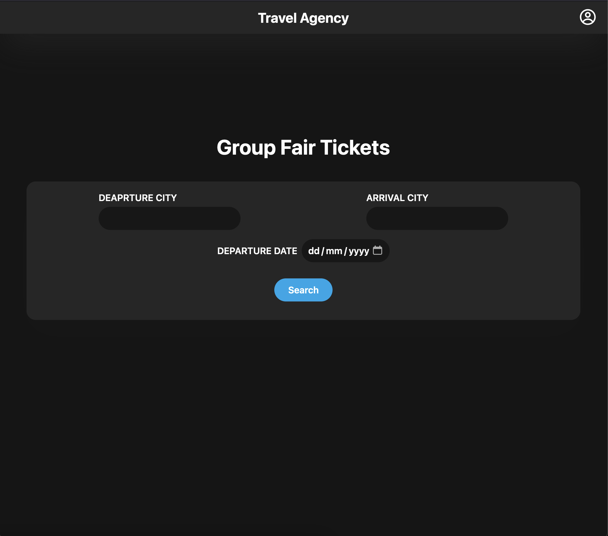

# TicketGalaxy - Flight Ticket Booking Platform

**Ticket Booking Platform** is a robust solution for managing and facilitating event ticket sales. Built with modern web technologies like Next.js, TypeScript, Tailwind CSS, and Supabase, this platform ensures seamless transactions and a user-friendly experience.

---

## Screenshots

### Home Page

### Login Page

### Agency Dashboard

### Uploading Tickets

### Database Tables

---

## Features

- **User Authentication**

  - Users can create accounts and log in to access the platform.
  - Secure and smooth authentication process via email communications.

- **Account Management**

  - Users can manage their accounts, update profiles, and view their purchase history.

- **Ticket Publishing**

  - Event organizers can publish tickets with comprehensive event details.
  - Details include event name, date, time, location, and ticket price.

- **Ticket Browsing and Purchasing**

  - Buyers can browse available tickets through a responsive and intuitive interface.
  - Users can filter and search for specific events.
  - Secure and straightforward ticket purchasing process.

- **Email Communications**
  - Streamlined email communications for account verification and purchase confirmations.
  - Automated emails ensure users are always informed about their transactions.

---

## Technology Stack

- **Next.js**: A powerful React framework for building server-side rendered applications, ensuring smooth and efficient rendering.
- **TypeScript**: A statically typed superset of JavaScript that enhances code quality and maintainability.
- **Tailwind CSS**: A utility-first CSS framework for rapidly building custom user interfaces, ensuring a responsive design.
- **Supabase**: An open-source backend as a service that provides scalable data storage and real-time capabilities.

---

## Usage

1. **Create an Account**

   - Navigate to the sign-up page.
   - Enter your email and other required details.
   - Verify your email through the confirmation link sent to your inbox.

2. **Publish a Ticket**

   - Log in as an event organizer.
   - Click on "Publish Ticket."
   - Enter event details such as name, date, time, location, and price.
   - Submit the form to make the event live.

3. **Browse and Purchase Tickets**

   - Log in as a buyer.
   - Browse the list of available events.
   - Use filters and search to find specific events.
   - Select an event and proceed to purchase tickets.
   - Complete the transaction and receive a confirmation email.

4. **Manage Account**
   - Login to view and update your profile.
   - Check your purchase history for all previous transactions.

---

## Conclusion

The Ticket Booking Platform provides a seamless and efficient way to manage event ticket sales and purchases. With its user-friendly interface, robust feature set, and reliable technology stack, it ensures a smooth experience for both event organizers and ticket buyers.

---
